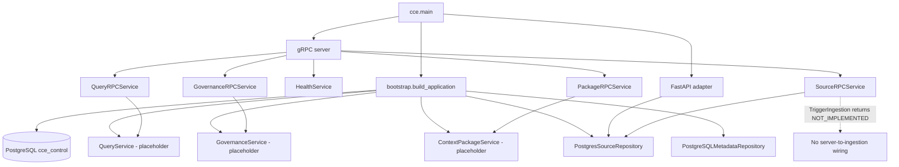
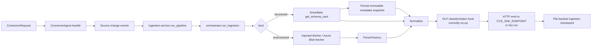
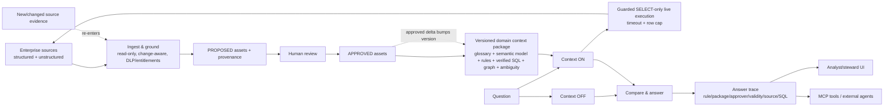

# CCE Architecture

This document deliberately separates what the repository **does now** from the supplied **target architecture**. The target is not a description of current runtime behavior.

## Current Implementation Architecture

### Component status

| Component | Status | Current evidence |
|---|---|---|
| Protobuf contracts / generated gRPC bindings | **IMPLEMENTED** | `backend/proto/cce/v1/`, `backend/src/cce/gen/cce/v1/` |
| gRPC server assembly | **IMPLEMENTED** | `backend/src/cce/rpc/server.py::create_server()` registers five services |
| HTTP/JSON adapter | **PARTIAL** | health + source registration work; source test/ingest and governed services are placeholders |
| Snowflake connector | **IMPLEMENTED** | `SnowflakeConnector` |
| Azure Blob unstructured support | **PARTIAL** | real fetch/process code exists, but there is no fully wired source-service path |
| Connector change observation | **PARTIAL** | event/dedup logic exists; provider listers and durable observer checkpoints are not production-wired |
| Structured metadata snapshot persistence | **IMPLEMENTED** | `PostgreSQLMetadataRepository`, migrations `001_*`/`002_*` |
| Document parsing/normalization | **IMPLEMENTED** | `ParserFactory`, canonical document normalizer |
| End-to-end ingestion from server API | **PARTIAL** | real ingestion workflow exists, `TriggerIngestion` does not call it |
| DLP / entitlement enforcement | **PARTIAL** | hook/helper exist, real classification/retrieval enforcement do not |
| Governance lifecycle | **PLANNED** | placeholder service; no governance tables |
| Context packages | **PLANNED** | models/helpers only; no persistence/service behavior |
| Governed query runtime | **PLANNED** | placeholder orchestrator/service/resolvers |
| Guarded SQL runtime | **PARTIAL** | prefix-only guard; runtime executor stub; not wired to Snowflake execution |
| Context OFF / Context ON proof | **PLANNED** | `runtime/proof.py` returns `{}` |
| Answer trace/audit | **PLANNED** | pass-through service; audit migration empty |
| MCP server | **PLANNED** | `create_mcp_server()` returns a dict, not a protocol server |
| UI | **PLANNED** | `frontend/README.md` only |

### Current server topology



### Current ingestion topology

The meaningful ingestion implementation is callable independently of the source RPC/HTTP trigger.



Key current properties:

- Snowflake connection safety is real: `SnowflakeConnector.connect()` attempts a temporary-table write and fails closed when the write succeeds.
- `snowflake_schema_fetcher()` calls `get_schema_card()`, so schema, row count, and one sample row per readable table can be fetched.
- The structured persistence node stores schema/table/column metadata and row counts, but **not sample rows**.
- Unstructured parsing supports text/Markdown, CSV, Excel, PDF/DOCX/PPTX via Docling, and common images via PaddleOCR when dependencies are available.
- DLP is wired into the graph but `security/dlp.py` is an explicit stub.
- Successful SDK emission can be a configured HTTP call or a dry-run when `CCE_SDK_ENDPOINT` is absent; therefore an ingestion success does not prove durable search/graph indexing.
- The active ingestion path does not create governance proposals or domain-package assets.

### Current persistence boundaries

`cce_control` currently contains meaningful tables only for registration and structured metadata:

```text
cce_source
  -> cce_namespace
      -> cce_schema
          -> cce_schema_snapshot (immutable run snapshot)
              -> cce_table
                  -> cce_column
                  -> cce_constraint
              -> cce_relationship
                  -> cce_relationship_column_mapping
```

Evidence: `backend/migrations/cce_control/001_registry.sql`, `002_metadata.sql`, `002_metadata_01_details.sql`, `002_metadata_02_relationships.sql`.

The following migrations create empty schemas only and explicitly state that persistence is future work:

- `003_governance.sql`
- `004_context.sql`
- `005_runtime.sql`
- `006_audit.sql`

### Current external integrations

- **Snowflake:** real connector, key-pair auth, metadata/sample reads, arbitrary query method, live write-probe.
- **Azure Blob:** SDK-backed listing/processing class plus an SDK-backed per-object fetcher; wiring is split across two paths.
- **PostgreSQL:** real control/metadata repository and migrations.
- **Gemini:** `integrations/llm/client.py::complete()` uses `ChatGoogleGenerativeAI`, temperature 0. No production CCE flow calls it.
- **AgenticPlane:** boundary package exists; `AgenticPlaneClient.retrieve()` always returns `[]`.

### Current API boundaries

- **Primary contract:** protobuf-first gRPC, per ADR-001.
- **Thin JSON adapter:** `http/app.py`, per ADR-004, maps to the same `Application` objects. It is not a separate runtime.
- **MCP:** no real protocol endpoint yet.
- Authentication/authorization gRPC interceptors are empty classes and are not installed in `rpc/server.py`.

## Target Architecture — not all components are currently implemented

The supplied Vision/MVP/architecture material describes this intended product flow:



Target architecture invariants from the supplied product material:

- domain-blind core; domain logic lives in packages;
- Propose → Review → Approve human boundary;
- only approved knowledge can influence answers;
- source-level provenance and answer-level traceability;
- read-only source access and SELECT-only bounded execution;
- active reprocessing of changed evidence and package version bumps;
- entity resolution across documents and structured sources;
- Context OFF versus Context ON comparison;
- same governed runtime served through UI and MCP.

## Verified architecture mismatches

### 1. Ingestion stops before the governance firewall

**Expected:** ingested evidence produces proposed, traceable context candidates that require human approval.

**Current:** `ingestion/orchestrator.py` normalizes, runs no-op DLP, emits to a generic SDK endpoint, and checkpoints. No node calls `GovernanceService` or writes governance tables.

**Status: PARTIAL**

### 2. Server source API is disconnected from the real ingestion workflow

**Expected:** source trigger drives the connector/ingestion path.

**Current:** `SourceRPCService.TriggerIngestion()` and `POST /sources/{source_id}/ingest` return not-implemented responses. `ingestion.service.run_pipeline()` exists separately.

**Status: PARTIAL**

### 3. Governance, package, runtime, trace, and MCP form a scaffold, not a vertical slice

**Expected:** approved assets become versioned packages, Context ON resolves/apply rules and guarded SQL, answer is traced, MCP serves it.

**Current:** services and migrations in those layers are placeholders; runtime returns a fixed not-implemented message; MCP has no protocol server.

**Status: PLANNED**

### 4. Approved-only invariant is not end-to-end enforceable yet

**Expected:** no unapproved asset can be retrieved/served.

**Current:** `require_approved()` exists and package builder can assert statuses, but there is no live governed retrieval/runtime path where this check is mandatory.

**Status: PARTIAL**

### 5. SQL safety boundary is incomplete

**Expected:** approved/verified SQL only, SELECT-only, timeout, row cap, read-only warehouse role.

**Current:** Snowflake connection read-only verification is strong; `runtime/sql_guard.py` only checks the first token; it is not invoked by `SnowflakeConnector.execute_query()`, which applies no row cap or statement timeout.

**Status: PARTIAL**

### 6. Registry breadth exceeds executable connector breadth

**Expected:** registry describes supported executable adapters.

**Current:** `connectors/registry.py` marks Postgres, Databricks, BigQuery, Google Drive, Gmail, SharePoint, Slack, Confluence, local-fs and Azure Blob as `READY`, while `ConnectorFactory` has a structured implementation only for Snowflake and unstructured observation requires injected provider listers. Azure Blob has real helper code but is not equivalent to all advertised adapters.

**Status: PARTIAL / misleading metadata**

### 7. Security hooks are not enforcement boundaries yet

**Expected:** DLP/PII and entitlements apply before candidate knowledge and at retrieval; caller authentication/authorization gates APIs.

**Current:** DLP is a documented no-op stub, entitlement/role helpers have no active runtime consumers, and gRPC authentication/authorization interceptors are empty/unregistered.

**Status: PARTIAL**

### 8. Deployment packaging does not install the full declared runtime dependency set

**Expected:** containerized backend can execute all enabled code paths.

**Current:** `deploy/docker/Dockerfile.backend` manually installs a subset and uses `pip install --no-deps .`; it omits several packages declared in `backend/pyproject.toml` required by ingestion/connectors/LLM paths.

**Status: PARTIAL**

## Modification boundaries

- Add/fix a provider connector in `connectors/`; do not add business rules there.
- Change ingest transformations in `ingestion/`; do not make ingestion directly serve query context.
- Implement approval state and persistence in `governance/` + `003_governance.sql`.
- Implement package composition/version persistence in `context_packages/` + `004_context.sql`.
- Implement question reasoning/guarded execution/Context proof in `runtime/` + `005_runtime.sql`.
- Implement answer lineage in `traceability/` + `006_audit.sql`.
- Keep gRPC/HTTP/MCP adapters thin over the same application behavior.
