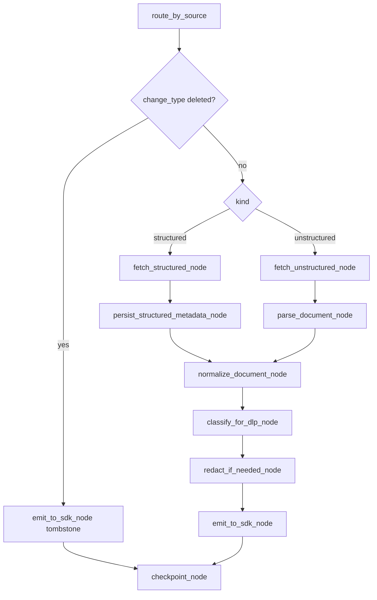

# Ingestion Flow

Status: **CURRENT / PARTIAL**

This is the actual executable ingestion workflow; it is **not** the full target CCE lifecycle.

## Caller composition

```text
ConnectorRequest
  -> ingestion.service.run_pipeline()
      -> ConnectorAgent.handle()
      -> for each ConnectorResponse.change_event:
           orchestrator.run_ingestion(...)
```

`run_pipeline()` can accept injected connector agent, fetchers, SDK emitter, checkpoint store and metadata repository for tests/integration composition.

## LangGraph sequence



## Structured lane — current

1. `_default_fetch_structured()` accepts only `adapter == "snowflake"`.
2. `snowflake_schema_fetcher()` builds config from environment and creates `SnowflakeConnector`.
3. `connect()` performs the live write probe.
4. `get_schema_card()` reads INFORMATION_SCHEMA, row counts and one sample row/table.
5. `persist_structured_metadata_node()` canonicalizes native types and writes a new snapshot via `MetadataRepository` when `CCE_CONTROL_DATABASE_URL` is available.
6. Repository absence/failure is downgraded to warnings so SDK emission can continue.
7. `normalize_document_node()` converts the schema card to canonical payload.

Status: **IMPLEMENTED components, PARTIAL product wiring** because the server source trigger does not call this flow.

## Unstructured lane — current

1. `fetch_unstructured_node()` requires an injected fetch function; `connectors.fetch.azure_blob_fetcher()` is the concrete helper currently available.
2. `parse_document_node()` writes bytes to a temporary file and chooses a parser through `ParserFactory`.
3. `normalize_document_node()` converts parser output to the canonical document structure.
4. Temporary parser file is removed after processing.

Status: **PARTIAL** because provider discovery/fetch composition and server triggering are incomplete.

## DLP and redaction — current

`classify_for_dlp_node()` and `redact_if_needed_node()` are real graph nodes, but the called implementation in `security/dlp.py` explicitly returns PUBLIC with confidence 1.0 and `redact_text()` returns the original input.

Status: **PARTIAL hook / PLANNED enforcement**.

## Downstream emit — current

`_default_sdk_emit()`:
- POSTs JSON to `CCE_SDK_ENDPOINT` when configured;
- returns a dry-run response when endpoint is absent.

`emit_to_sdk_node()` records warnings/errors and `ready_for_sdk` state.

There is no verified call to `integrations.agentic_plane.AgenticPlaneClient` from this workflow, and that adapter currently cannot index/search/graph content.

Status: **PARTIAL**.

## Checkpointing — current

`IngestionCheckpointStore` stores JSON files at `CCE_CHECKPOINT_STORE_PATH` (or default `.ingestion_checkpoints`). Docker Compose mounts this path to a named volume.

This is distinct from connector observation checkpoint/dedup, whose default stores are in-memory.

## What does not happen after this flow

The current workflow does **not**:

```text
create proposal
-> human review
-> approve/reject
-> build/version package
-> make approved context retrievable
```

Those are target architecture steps and remain unimplemented.
