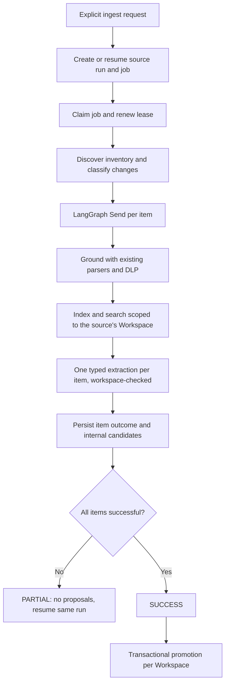

# Governed ingestion flow

`POST /workspaces/{workspace_id}/sources/{source_uuid}/ingest` creates or resumes one durable source run and enqueues a PostgreSQL job. Production bootstrap injects `IngestionRepository`; the old per-thread SourceService path is retained only for legacy callers/tests. `cce.main` starts the leased job worker. There are no source listeners, provider polling jobs, webhooks, Redis queues, or LangGraph checkpoint databases.

The source graph is `ingestion/source_graph.py`. `grounding.py` directly reuses existing parsers, normalizers and DLP helpers through typed input/output models. It does not invoke the legacy per-item graph or its SDK emit/checkpoint nodes. One warehouse table is one source item. Hashes cover table identity, column/type metadata and configured samples, excluding table row counts. Structured schema snapshots remain in the existing metadata repository. Governed structured ingestion rejects truncated `max_tables` inventories; document discovery reads the complete configured prefix.

Stable CCE UUIDs are associated with native object IDs, or canonical URIs when no native ID exists. New/changed items are processed concurrently (default five); identical successful items are skipped on resume, but changed-again items are retried. Source-level inventory failures fail the run; item fetch/parser/model/index errors make it PARTIAL. Candidates are private staging records until the entire run completes.

There is no domain-detection step. A source belongs to exactly one Workspace (`cce_source.workspace_uuid`); each item is indexed and extracted directly against that Workspace, and the extraction LLM call rejects (`"Extraction crossed workspace or attempted removal"`) any candidate that reports a different `workspace_uuid` or an unrequested REMOVE. AgenticPlane 1.3 metadata filters are used for source/item/run/Workspace-scoped extraction. The CCE index identity includes the hash/run so new candidates do not erase evidence still supporting an active package.

Promotion merges exact semantic duplicates and their evidence. Changed payloads under an active canonical identity become UPDATE proposals; conflicting payloads become an AMBIGUITY proposal containing alternatives. Ambiguous non-exact identity is delegated to the structured extractor with an explicit ambiguity requirement; no approximate automatic UPDATE target is assigned.

Missing items retain history. A REMOVE candidate is staged only when an active asset has no other available evidence. Missing source availability alone never changes an active package. Exact semantic no-change can add evidence links without revising the immutable approved payload or creating a package version.

The job table uses leases, claim tokens and `FOR UPDATE SKIP LOCKED`. Writes check lease ownership. A restarted worker can reclaim an expired lease, retain successful item outcomes and retry failed work. Promotion is idempotent per run/Workspace and can resume after a crash following SUCCESS. Externally visible ingestion status is exactly `RUNNING`/`SUCCESS`/`PARTIAL`/`FAILED`; only a SUCCESS run is a valid candidate for proposal promotion/package evolution.

DLP is a deterministic baseline for email, SSN and common phone patterns. It is not comprehensive enterprise PII detection. Legacy standalone ingestion remains available to older callers; production grounding uses typed source/item/output models and invokes reusable deterministic helpers directly.

## Evidence transport update (2026-09-09; partial enhancement delivery)

The shared index chunker now walks normalized content elements and nested children,
retains heading ancestry, and uses `cl100k_base` token counts with configurable
1000-token targets and 125-token textual overlap. Paragraph/line/sentence/word
boundaries are preferred when splitting oversized elements. Small tables render
as one Markdown table; oversized tables split without overlap. Offsets for tables
refer to their rendered Markdown, not physical document byte positions. Small
adjacent elements are not packed together. The original normalized input is not
mutated. Chunk UUIDs include source/document/version/element coordinates and text.
The local index uses those UUIDs for repeat-write upserts; this does not establish
hosted AgenticPlane write idempotency or CDC supersession.

Both index implementations use a common Markdown envelope and retain structured
metadata, including `record_type`, section path, element ID, chunk ID, offsets,
and supplied page/bbox/confidence. Grounding retains supplied parser coordinates
and DOCX parsing preserves paragraph/table order. Governance evidence stores the
retrieved metadata; runtime citations add `coordinates` and a readable `label`.
The existing protobuf branch citation `Struct` supports these additive fields;
no protobuf schema change or database migration was introduced in this update.

PDF extraction now selects RapidOCR per page below
`CCE_PDF_NATIVE_MIN_CHARS` (default 20 alphanumeric characters), preserving native
text on other pages. OCR is injectable behind the parser callback; RapidOCR uses
its ONNX default engine. OCR bounding boxes are rendered-pixel coordinates with
render scale 2 recorded in metadata. No page/element truncation is performed.
An unreadable page fails the document rather than returning silently incomplete
successful evidence. OCR model provisioning and hosted OCR execution are not
validated by the fixture tests.

Workspace models/migration/APIs/ownership, Workspace-scoped proposal audit and
feedback memory (called out here as not yet implemented at the time) were
completed by the Workspace refactor (see
`docs/decisions/ADR-005-workspace-replaces-domain.md`). Centralized
three-attempt retries and hosted retry-safe writes/supersession remain
outstanding.

## Typed source discovery

Catalog configurations use `schema_selection.mode` = `all` or `selected` for
Snowflake, PostgreSQL and SQL Server. All mode calls `list_schemas` each ingestion;
selected mode validates availability. MySQL uses its configured database. Each
schema contributes source items through the same durable source graph, scoped to
the source's Workspace. Drive exports remain temporary parser inputs.
