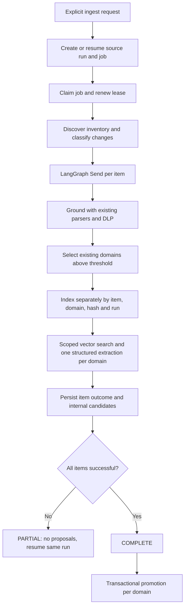

# Governed ingestion flow

`POST /sources/{source_id}/ingest` creates or resumes one durable source run and enqueues a PostgreSQL job. Production bootstrap injects `IngestionRepository`; the old per-thread SourceService path is retained only for legacy callers/tests. `cce.main` starts the leased job worker. There are no source listeners, provider polling jobs, webhooks, Redis queues, or LangGraph checkpoint databases.

The source graph is `ingestion/source_graph.py`. `grounding.py` directly reuses existing parsers, normalizers and DLP helpers through typed input/output models. It does not invoke the legacy per-item graph or its SDK emit/checkpoint nodes. One warehouse table is one source item. Hashes cover table identity, column/type metadata and configured samples, excluding table row counts. Structured schema snapshots remain in the existing metadata repository. Governed structured ingestion rejects truncated `max_tables` inventories; document discovery reads the complete configured prefix.

Stable CCE UUIDs are associated with native object IDs, or canonical URIs when no native ID exists. New/changed items are processed concurrently (default five); identical successful items are skipped on resume, but changed-again items are retried. Source-level inventory failures fail the run; item fetch/parser/model/index errors or unresolved domains make it PARTIAL. Candidates are private staging records until the entire run completes.

Domain detection selects only enabled administrator-created domains, records append-only detection results, and never reduces confidence thresholds. Current source-domain associations are recomputed after successful completion. An item can belong to multiple domains. AgenticPlane 1.3 metadata filters are used for source/item/run/domain-scoped extraction. The CCE index identity includes the hash/run so new candidates do not erase evidence still supporting an active package.

Promotion merges exact semantic duplicates and their evidence. Changed payloads under an active canonical identity become UPDATE proposals; conflicting payloads become an AMBIGUITY proposal containing alternatives. Ambiguous non-exact identity is delegated to the structured extractor with an explicit ambiguity requirement; no approximate automatic UPDATE target is assigned.

Missing items retain history. A REMOVE candidate is staged only when an active asset has no other available evidence. Missing source availability alone never changes an active package. Exact semantic no-change can add evidence links without revising the immutable approved payload or creating a package version.

The job table uses leases, claim tokens and `FOR UPDATE SKIP LOCKED`. Writes check lease ownership. A restarted worker can reclaim an expired lease, retain successful item outcomes and retry failed work. Promotion is idempotent per run/domain and can resume after a crash following COMPLETE.

DLP is a deterministic baseline for email, SSN and common phone patterns. It is not comprehensive enterprise PII detection. Legacy standalone ingestion remains available to older callers; production grounding uses typed source/item/output models and invokes reusable deterministic helpers directly.
