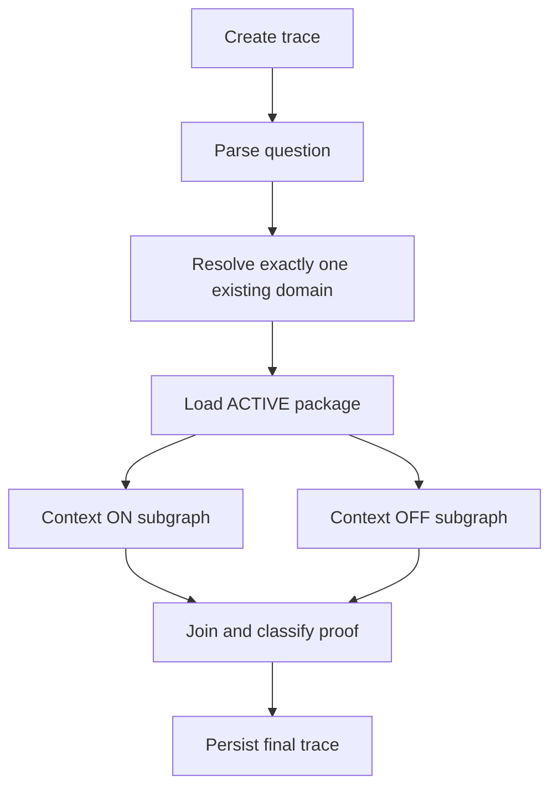

# Governed query runtime

`POST /query` is synchronous. HTTP, gRPC and the MCP Python helper call the same `QueryService` and typed `QueryResponse`.

An explicit domain is validated; otherwise a structured LLM chooses an existing domain above the configured threshold. Intent classification distinguishes document/policy questions from questions requiring current transactional rows. Policy deadlines and procedures do not require SQL.

Context ON searches AgenticPlane vector memory and its GraphRAG endpoint concurrently. Vector search is filtered by domain and registered source IDs and retains the configured minimum score. Source passages remain in the answer context even if they have no individually approved asset. Graph entities are included only when all their source memories are in the scoped vector results; relationships require both endpoints to be included. Unverifiable graph summaries are excluded. Graph outages produce an explicit warning while vector evidence remains available.

The active domain package is supplemental context, not a prerequisite or a filter on source facts. Approved assets linked to retrieved memories or their source documents, plus their package-bounded dependency expansion, supplement the raw passages and source-linked graph. No active package is required when scoped source evidence is available. Source instructions are never trusted; precise policy facts come from original passages, with conflicting conditions stated explicitly. Query traces retain a `hybrid_retrieval` record with source passages and graph results; citations include vector memory IDs and source URIs.

OFF receives only the question and raw source/schema metadata, never vectors, graph results or package assets. Both branches use the same answer model. A live-data question resolves one structured source (using relevant mappings or the domain's registered structured sources), then enters the guarded SQL pipeline. A document question goes directly to evidence-based synthesis. No federated joins or additional CCE row-level entitlement engine exists.

Both branches use `SQLPipeline`, a LangGraph subgraph:

`generate_sql -> parse_sql -> validate_sql -> guard_sql -> execute_sql`

Failures route through `describe_sql_error -> persist_attempt -> regenerate`, with one shared budget of one initial attempt plus `CCE_SQL_MAX_RETRIES`. Error analysis receives only the SQL and exact error. Every attempt and structured SQL node artifact is persisted. SQL examples are grounding examples, not mandatory templates; missing examples generate a warning and do not prohibit generation.

The SQL guard uses sqlglot ASTs, permits read-only CTE/SELECT queries, rejects writes/multiple statements/administrative operations/unknown functions, validates physical source scope and column references where resolvable, and imposes an outer result limit. Snowflake execution uses the configured role, a statement timeout and bounded fetch. It does not rely on a text prefix check.

Responses contain domain/package resolution, equally shaped ON/OFF results, SQL attempts, citations, context references, warnings, errors and proof. SQL and evidence references are generated by CCE rather than fabricated by the answer model. `CCE_QUERY_INCLUDE_ROWS=false` hides external rows while retaining rows for synthesis and durable trace artifacts.

A failed branch remains a structured response with HTTP 200. Request validation/authorization failures use 4xx; infrastructure failures outside branch execution use 5xx and retain a failure trace when PostgreSQL remains available. Proof is NOT_COMPARABLE when either branch lacks a successful answer. Improvement classifications are model interpretations, not measured accuracy or a benchmark lift claim. No hidden model chain-of-thought is requested or persisted.
