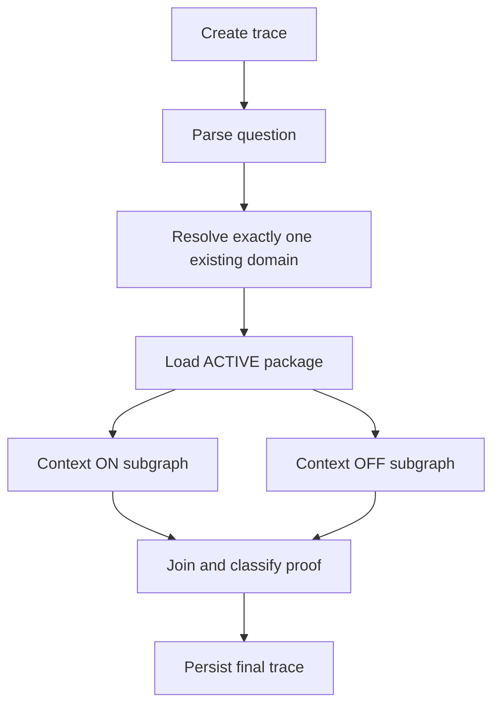

# Governed query runtime

`POST /query` is synchronous. HTTP, gRPC and the MCP Python helper call the same `QueryService` and typed `QueryResponse`.

An explicit domain is validated; otherwise a structured LLM chooses the highest-scoring existing domain above `CCE_DOMAIN_MIN_CONFIDENCE`. There is no score-margin rule and no threshold relaxation. An unresolved domain skips both branches and asks for domain selection. Without an active package, ON reports NO_ACTIVE_PACKAGE while OFF can still run.

ON uses AgenticPlane vector search with domain and source metadata filters, oversamples, applies the minimum score and maps memory IDs through PostgreSQL evidence records to the captured ACTIVE manifest. Unlinked candidate memories never govern answers. If no eligible hit remains, ON returns INSUFFICIENT_CONTEXT without invoking answer synthesis. Raw vector text is removed from the reasoning bundle; only approved asset payloads govern the answer.

Approved hits seed PostgreSQL `graph_entity`/`graph_edge` expansion, restricted to the package manifest and configured hop limit (default two). Explicit asset dependencies are loaded as structural references. The resulting relevant asset slice includes governed glossary, policies/validity, entities, mappings, SQL examples and ambiguities; it is not the entire package. The runtime never calls AgenticPlane graph retrieval.

OFF receives question and raw schema/source metadata only. It never receives package assets, vector evidence, policies or semantic mappings. Both branches run in parallel and use the same configured answer model. Non-live questions do not execute SQL. A live branch must resolve exactly one structured source; ambiguous/unavailable sources return DATA_SOURCE_UNRESOLVED. No federated joins or additional CCE row-level entitlement engine exists.

Both branches use `SQLPipeline`, a LangGraph subgraph:

`generate_sql -> parse_sql -> validate_sql -> guard_sql -> execute_sql`

Failures route through `describe_sql_error -> persist_attempt -> regenerate`, with one shared budget of one initial attempt plus `CCE_SQL_MAX_RETRIES`. Error analysis receives only the SQL and exact error. Every attempt and structured SQL node artifact is persisted. SQL examples are grounding examples, not mandatory templates; missing examples generate a warning and do not prohibit generation.

The SQL guard uses sqlglot ASTs, permits read-only CTE/SELECT queries, rejects writes/multiple statements/administrative operations/unknown functions, validates physical source scope and column references where resolvable, and imposes an outer result limit. Snowflake execution uses the configured role, a statement timeout and bounded fetch. It does not rely on a text prefix check.

Responses contain domain/package resolution, equally shaped ON/OFF results, SQL attempts, citations, context references, warnings, errors and proof. SQL and evidence references are generated by CCE rather than fabricated by the answer model. `CCE_QUERY_INCLUDE_ROWS=false` hides external rows while retaining rows for synthesis and durable trace artifacts.

A failed branch remains a structured response with HTTP 200. Request validation/authorization failures use 4xx; infrastructure failures outside branch execution use 5xx and retain a failure trace when PostgreSQL remains available. Proof is NOT_COMPARABLE when either branch lacks a successful answer. Improvement classifications are model interpretations, not measured accuracy or a benchmark lift claim. No hidden model chain-of-thought is requested or persisted.
